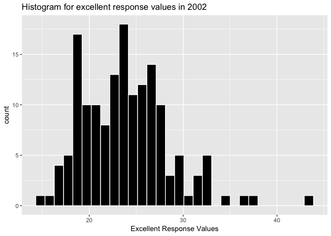

p8105\_hw2\_pm2995
================
Priyal
9/25/2018

### Problem 1.1: Read and clean the data as instructed

The code below imports the data from the .csv file, cleans the variable names, selects the column names that are going to be kept in the resulting data frame and mutates a variable to recode it.

``` r
nyc_transit = 
  read_csv("./data/NYC_Transit_Subway_Entrance_And_Exit_Data.csv",col_names = TRUE) %>%
  
  janitor::clean_names() %>% 
  
 select(line:entry, vending, ada) %>% 
  mutate(entry = recode(entry, YES = "TRUE", NO = "FALSE"))
```

    ## Parsed with column specification:
    ## cols(
    ##   .default = col_character(),
    ##   `Station Latitude` = col_double(),
    ##   `Station Longitude` = col_double(),
    ##   Route8 = col_integer(),
    ##   Route9 = col_integer(),
    ##   Route10 = col_integer(),
    ##   Route11 = col_integer(),
    ##   ADA = col_logical(),
    ##   `Free Crossover` = col_logical(),
    ##   `Entrance Latitude` = col_double(),
    ##   `Entrance Longitude` = col_double()
    ## )

    ## See spec(...) for full column specifications.

I have decribed all the steps used for the above code chunk in more detail under Problem 1.2 as it specifically asked for it there.

### Problem 1.2

Describing the data set and data cleaning steps so far

Dataset focuses on NYC transit data and has collection of information related to each subway station entrance and exit. We have edited some information from the raw data and now our data set has variables; line, station name, station lattitude, longitude, route 1 to 11, entrance type, entry, vending and compliance with ADA.

I want to specify that throughout the below mentioned steps I have used pipe operator ( %&gt;%) to use the result of one function call (part on the left of the %&gt;%) as the first argument of the next function call (part on right of the %&gt;%) . Here are the steps I used for cleaning the data:

1.  Used read\_csv for importing the csv file containing information on NYC transit entrance and exit. The csv function used is from the readr package. The first argument in the read\_csv is the path to the data. I have used the relative path to to navigate from the current working directory as they are portable and if I share this with someone it ensures reproducibility of the code. I used view in my console window to confirm if there were no unexpected results from the data importing step.

2.  After importing the data, I have cleaned the variable names using janitor::clean\_names function which converted all column names into lower snake case.

3.  I used select to retain the variable names as instructed in the problem. We are doing this step to de-clutter and keep only the subset of columns that will be useful to us.

4.  Further, I used mutate to recode the entry variable from character(YES/NO) to logical(TRUE/FALSE).

The code chunk below generated the number of rows and columns in the nyc\_transit data frame. I have also written the same in inline R code form.

``` r
nrow(nyc_transit)
```

    ## [1] 1868

``` r
ncol(nyc_transit)
```

    ## [1] 19

The dimensions of the data set are 1868 x 19.

-   Are these data tidy?

No, the data doesn't look tidy because the data for the route variable are spread across eleven columns and is difficult to read. There can be a better way to present it. Using the gather function here can be helpful.

### Problem 1.3: Answering the set of questions

1.  How many distinct stations are there? Note that stations are identified both by name and by line (e.g. 125th St A/B/C/D; 125st 1; 125st 4/5); the distinct function may be useful here.

Answer: The code below generated the distinct stations that are identified by both station name and line. I used distinct function here that retains only the unique rows which can determined by the variables we use along with it. Since distinct stations are identified by both name and by line, I used these two variables with distinct. .keep\_all = TRUE was used to keep all the variables in the data.

``` r
nyc_transit %>%  
  distinct(station_name, line, .keep_all = TRUE) %>% 
  nrow()
```

    ## [1] 465

No. of distinct stations = 465

1.  How many stations are ADA compliant?

Answer: The code below generated the ADA compliant stations. A part of explanation for the code is same as in the previous code chunk. I have used filter to specifically choose the ada == TRUE values that indicate that the entrance/exit is ada compliant. Further on, I have just used the nrow to determine the number of such entries.

``` r
  nyc_transit %>%
  distinct(station_name, line, .keep_all = TRUE) %>% 
  filter(ada == TRUE) %>% 
  nrow()
```

    ## [1] 84

No. of ADA compliant stations = 84

1.  What proportion of station entrances / exits without vending allow entrance?

Answer: I used the code chunk below to generate the proportion of station entrances/exits without vending that allow entrance. I filtered all the entrances/ exits for which vending is NO and entry = TRUE and divided it with the total stations for which vending is NO. I calculated the number of rows in each part using the nrow function:

``` r
{nyc_transit %>% 
  filter(vending == "NO") %>% 
  filter(entry == "TRUE") %>% 
  nrow()} /
  
{nyc_transit %>% 
  filter(vending == "NO") %>% 
  nrow()}
```

    ## [1] 0.3770492

Alternatively, I also figured out another way which requires less coding steps to go ahead with this problem with the code chunk below:

``` r
no_vending = nyc_transit %>% 
  filter(vending == "NO")  
  no_vending_entrance = mean(no_vending$entry == TRUE)
```

I created a dataframe where I kept all the stations entrances/ exits without vending. I further took the mean of the logical vector (entry ==TRUE) to get the proportion of station entrances / exits without vending that allow entrance.

Proportion of station entrances / exits without vending that allow entrance = 0.3770492 or 37.7 %

### Problem 1.4: Reformating the data so that route number and route name are distinct variables

Route data was spread across eleven columns which corresponds to route names and route number. I used gather to tidy the data, which converted it from the wide to the long format and saved it into a new data frame nyc\_data\_reformat. Now the data looks so much better!

``` r
nyc_transit_reformat = 
  gather(nyc_transit, key = route_number, value = route_name, route1:route11) 

nyc_transit_reformat
```

    ## # A tibble: 20,548 x 10
    ##   line  station_name station_latitude station_longitu… entrance_type entry
    ##   <chr> <chr>                   <dbl>            <dbl> <chr>         <chr>
    ## 1 4 Av… 25th St                  40.7            -74.0 Stair         TRUE 
    ## 2 4 Av… 25th St                  40.7            -74.0 Stair         TRUE 
    ## 3 4 Av… 36th St                  40.7            -74.0 Stair         TRUE 
    ## # ... with 2.054e+04 more rows, and 4 more variables: vending <chr>,
    ## #   ada <lgl>, route_number <chr>, route_name <chr>

-   How many distinct stations serve the A train?

Answer: I used the nyc\_transit\_reformat data frame created from the previous code chunk to answer this question as I had to specifically use the rows that had route\_name == A. I filtered those rows and use the distinct function with variables station\_name and line to just keep the distinct station names. Using nrow gave me the answer to the number of distinct stations that serve the Train A.

``` r
  nyc_transit_reformat %>% 
  filter(route_name == "A") %>% 
  distinct(station_name, line, .keep_all = TRUE) %>% 
nrow()
```

    ## [1] 60

Distinct stations that serve train A = 60

I have used .keep\_all in this and next code chunk with the distinct function because I wanted to keep rest of the variable data associated with the distinct stations for further use.

-   Of the stations that serve the A train, how many are ADA compliant?

Answer: Following the same initial steps as in previous code chunk, I have added another argument to filter to retain the rows which indicated that the station entrance/ exit was ada compliant.

``` r
nyc_transit_reformat %>% 
  filter(route_name == "A", ada == TRUE) %>%
  distinct(station_name, line, .keep_all = TRUE) %>% 
  nrow()
```

    ## [1] 17

Of the stations that serve the train A, no. of stations that are ADA compliant are 17.

### Problem 2.1: Read and clean the Mr. Trash Wheel sheet

The code chunk below imports the specific data from the xlsx file in and performs some data manipulation steps:

``` r
library(readxl)
trash_wheel_data = read_excel("./data/HealthyHarborWaterWheelTotals2017-9-26.xlsx", sheet = "Mr. Trash Wheel", range = cell_cols("A:N"), col_names = TRUE) %>% 
  janitor::clean_names() %>% 
  filter(!(dumpster == "NA")) %>% 
  mutate(sports_balls = round(sports_balls)) %>% 
  mutate(sports_balls = as.integer(sports_balls))

trash_wheel_data
```

    ## # A tibble: 216 x 14
    ##   dumpster month  year date                weight_tons volume_cubic_ya…
    ##      <dbl> <chr> <dbl> <dttm>                    <dbl>            <dbl>
    ## 1        1 May    2014 2014-05-16 00:00:00        4.31               18
    ## 2        2 May    2014 2014-05-16 00:00:00        2.74               13
    ## 3        3 May    2014 2014-05-16 00:00:00        3.45               15
    ## # ... with 213 more rows, and 8 more variables: plastic_bottles <dbl>,
    ## #   polystyrene <dbl>, cigarette_butts <dbl>, glass_bottles <dbl>,
    ## #   grocery_bags <dbl>, chip_bags <dbl>, sports_balls <int>,
    ## #   homes_powered <dbl>

I used read\_excel from readxl package for importing the xlsx file containing information about the healthy harbor water wheel. The first argument in the read\_excel is the path to the data. I have used the relative path to to navigate from the current working directory as they are portable and if I share this with someone it ensures reproducibility of the code. Along with path, I have used sheet argument to specify the sheet in the xlsx file that contained the data I want to use and further also specified the range of columns I wanted to keep using 'range' function. I used view in my console window to confirm if there were no unexpected results from the data importing step. After importing the data, I cleaned the variable names using janitor::clean\_names function which converted all column names into lower snake case.

I used filter with ! to remove the rows that didn't contain any dumpster specific information. Further, I used mutate to change the variable sports\_balls using function round to round the number of sports balls to nearest integer and converted it to an integer variable using as.integer function.

### Problem 2.2: Reading and cleaning precipitation data for 2016 and 2017

The code chunk below imports the specfic sheet data from the xlsx file in and performs some data manipulation steps:

``` r
precipitation_2016 =
  read_excel(path = "./data/HealthyHarborWaterWheelTotals2017-9-26.xlsx", sheet = "2016 Precipitation", range = "A2:B14", col_names = TRUE) %>%
  janitor::clean_names() %>% 
  rename(precipitation = total) %>% 
  filter(!is.na(precipitation)) %>% 
  mutate(year = 2016)
  
precipitation_2017 =
  read_excel(path = "./data/HealthyHarborWaterWheelTotals2017-9-26.xlsx", sheet = "2017 Precipitation", range = "A2:B14", col_names = TRUE) %>% 
  janitor::clean_names() %>% 
  rename(precipitation = total) %>% 
  filter(!is.na(precipitation)) %>% 
  mutate(year = 2017)
```

Here again I have used read\_excel for importing the xlsx file containing information about the healthy harbor water wheel. I have described its arguments already in the text of previous code chunk. While importing the data, I have specified the respective sheets for 2016 and 2017 precipitation data in xlsx file. I have removed the rows for which precipitation was na and added a new variable year in both the dataframes. I have also renamed the 'total' column. Now it os called 'precipitation' as I think this is a more reasonable variable name.

Combining datasets
------------------

The code chunk below combines the two precipitation dataframes from 2016 and 2017 using the full join:

``` r
precipitation_combined = 
  full_join(precipitation_2016, precipitation_2017) %>% 
  mutate(month = month.name[month])
```

    ## Joining, by = c("month", "precipitation", "year")

``` r
precipitation_combined
```

    ## # A tibble: 20 x 3
    ##    month     precipitation  year
    ##    <chr>             <dbl> <dbl>
    ##  1 January            3.23  2016
    ##  2 February           5.32  2016
    ##  3 March              2.24  2016
    ##  4 April              1.78  2016
    ##  5 May                5.19  2016
    ##  6 June               3.2   2016
    ##  7 July               6.09  2016
    ##  8 August             3.96  2016
    ##  9 September          4.53  2016
    ## 10 October            0.62  2016
    ## 11 November           1.47  2016
    ## 12 December           2.32  2016
    ## 13 January            2.34  2017
    ## 14 February           1.46  2017
    ## 15 March              3.57  2017
    ## 16 April              3.99  2017
    ## 17 May                5.64  2017
    ## 18 June               1.4   2017
    ## 19 July               7.09  2017
    ## 20 August             4.44  2017

Also, stacking them using the bind\_rows is also giving us the exact same result

``` r
precipitation_combined_alternate = 
  bind_rows(precipitation_2016, precipitation_2017) %>% 
  mutate(month = month.name[month])
```

### Problem 2.3: Writing a paragraph about the data and answering certain questions.

Data from the Mr. Trash Wheel sheet

Mr. Trash Wheel is a water wheel vessel removing trash flowing down the Jones Fall river in Baltimore state. The original dataset describes the content and the amount of trash collected by the dumpster. The data is available by the date of collection of the trash. After doing the instructed modifications on the original dataset, the resulting dataset includes 216 rows and 14 columns. The last row has Grand total, so we can exclude that one row from counting the total number of observations. The key variables included are the dumpster number, date when it was collected, amount of trash (by weight and volume), the content (plastics, grocery bags, sports balls, cigarette buts, etc.) and the approximate number of homes powered using the energy generated from the trash. The dataset includes data from 16th May 2014 till 19th August 2017. During this period the total amount of litter that was collected is 704.44. Looking at the data, it appears that cigarette butts are the most common form of trash and glass bottles the least common. The average amount of cigarette butts that were collected are 4.450046510^{4}. The average amount of glass bottles that were collected are 34.4697674. The approximate total number of homes that were powered by using the energy generated by the water wheel vessel are 8109.

The precipitation data sets for the year 2016 has 12 rows and 3 columns. The mean precipitation for the year 2016 is 3.3291667. The precipitation data sets for the year 2017 has 8 rows and 3 column. The mean precipitation for the year 2017 is 3.74125. The key variables for both the datasets are month, corresponding precipitation for that month and the year. The combined precipitation dataset for 2016 and 2017 includes 20 observations for 3 variables. The total precipitation in 2016 and 2017 was 69.88.

1.  For available data, what was the total precipitation in 2017?

Answer: The code chunk below gave me the sum for the total precpitation in 2017:

``` r
sum(precipitation_2017$precipitation)
```

    ## [1] 29.93

Answer: The total precipitation in 2017 is 29.93

1.  What was the median number of sports balls in a dumpster in 2016?

Answer: The code chunk below keeps all the rows that contained data for the year 2016. It further pulls the variable sports balls and then takes the median of it.

``` r
  trash_wheel_data %>%  
  filter(year == 2016) %>% 
  pull(sports_balls) %>% 
  median
```

    ## [1] 26

The median number of sports balls in a dumpster in 2016 are 26.

### Problem 3

The code chunk below installs and loads the dataset package required for the problem:

install.packages("devtools")
============================

``` r
devtools::install_github("p8105/p8105.datasets")
```

    ## Skipping install of 'p8105.datasets' from a github remote, the SHA1 (21f5ad1c) has not changed since last install.
    ##   Use `force = TRUE` to force installation

``` r
library(p8105.datasets)
data("brfss_smart2010")
```

### Problem 3.1

Data importing, tidying and manipulation steps

The code chunk below creates a dataframe using the data from the dataset package we loaded above and does some data manipulation as instructed in the problem using filter and select. I have also renamed variable names(locationabbr and locationdesc) so that they look more meaningful. I have further used the spread function to spread the response values across columns (Excellent to poor) and took their response values(proportions) from the data\_value variable. I have used mutate to generate a new variable that gives the proportion of excellent or very good response values. Further on, select has been used to order the column in a suitable way.

``` r
brfss_reformat = brfss_smart2010 %>% 
  janitor::clean_names() %>% 
  filter(topic == "Overall Health") %>% 
  select(-class, -topic, -question, -sample_size, -(confidence_limit_low:geo_location)) %>% 
  rename(state = locationabbr, county = locationdesc) %>% 
  spread(key = response, value = data_value) %>% 
  janitor::clean_names() %>% 
  mutate(
    excellent_or_very_good = excellent + very_good 
  ) %>% 
  select(year, state, county, excellent, very_good, good, fair, poor, excellent_or_very_good)
```

### Problem 3.2: Answering the specific questions

#### Problem 3.2.1

-   How many unique locations are included in the dataset?

Answer: The code chunk below gives us the number of unique locations. I have used distinct function to remove the duplicate rows and nrow to get the total number of unique locations:

``` r
brfss_reformat %>% 
  janitor::clean_names() %>%
  distinct(state, county) %>% 
  nrow()
```

    ## [1] 404

404 unique locations are represented

-   Is every state represented?

Answer: The code chunk below creates a new dataframe that gives us the information about the number of states represented. I also checked the states that were represented by viewing the brfss\_states using view(brfss\_states).

``` r
brfss_states = 
  brfss_reformat %>% 
  janitor::clean_names() %>%
  distinct(state) 

nrow(brfss_states)
```

    ## [1] 51

It has 51 observations, that include 50 states and federal district of Columbia(DC).

-   What state is observed the most?

Answer:

The code below uses the data from the brfss\_reformat to count the number of states and displays them in descending order by using the arrange function.

``` r
brfss_reformat %>% 
  janitor::clean_names() %>%
  count(state) %>% 
  arrange(desc(n, state))
```

    ## # A tibble: 51 x 2
    ##   state     n
    ##   <chr> <int>
    ## 1 NJ      146
    ## 2 FL      122
    ## 3 NC      115
    ## # ... with 48 more rows

NJ is observed the most.

#### Problem 3.2.2

-   In 2002, what is the median of the “Excellent” response value?

Answer: The code below keeps only the rows with from the year 2002 and takes the median of the excellent values. I have used na.rm = TRUE in case of there are missing values, the median won't take them into consideration before computing.

``` r
  filter(brfss_reformat, year == 2002) %>% 
  pull(excellent) %>% 
  median(na.rm = TRUE)
```

    ## [1] 23.6

Median of "Excellent response value" is 23.6

#### Problem 3.2.3

Make a histogram of “Excellent” response values in the year 2002.

Answer: The code below keeps the rows from brfss\_reformat that had values from the year 2002 and makes a histogram of the correspnding excellent response values. I have used some color and fill options to make the histogram look better. Also, I have added labels here for x axis and a title for the histogram.

``` r
filter(brfss_reformat, year == 2002) %>% 
  ggplot(., aes(x = excellent)) + 
  geom_histogram(color = "white", fill = "black") +
    labs(title = "Histogram for excellent response values in 2002", x = "Excellent Response Values")
```

    ## `stat_bin()` using `bins = 30`. Pick better value with `binwidth`.

    ## Warning: Removed 2 rows containing non-finite values (stat_bin).



From the histogram, it can be clearly seen that there is a wide range of excellent response values. From approximately 9 till 43. There are two major peaks at approximately 18 and 24.
